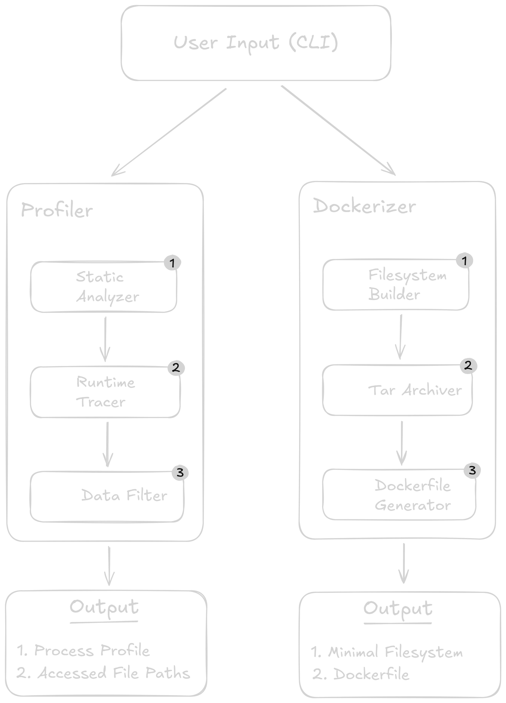

# System Workflow



---

**vm2container** is a Golang CLI tool for replatforming applications from Ubuntu-based enviroments to Docker containers. It has two functions:

🔹 `profile` – Captures and analyzes an application’s runtime behavior.  
🔹 `dockerize` – Uses profiling data to generate a containerized version of the application.

The only requirement for migration is the **main process ID (PID) of the target application**.

The details of each module are explained below.

---

## **1️⃣ Profiler Module**

The **Profiler** identifies the dependencies needed to recreate an application inside a container.

### **🔍 Static Analyzer**

- Examines the `/proc` filesystem to extract metadata about the running process.
- Collects:
  - Child PIDs, user, and group.
  - Executable path and working directory.
  - Open network ports and active Unix sockets.
  - Environment variables.
  - CPU, Memory, and Disk usage.
- Provides a baseline understanding of the application before runtime tracing.
- **Related Files:** [info.go](../internal/profiler/info.go), [resources.go](../internal/profiler/resources.go), [network.go](../internal/profiler/network.go)

### **📡 Runtime Tracer**

- Restarts the application with `strace` attached.
- **Captures system calls** about file-related events.
- Helps identify dynamic dependencies not visible from static analysis.
- **Related Files:** [restart.go](../internal/profiler/restart.go)

### **🗂️ Data Filter**

- Processes `strace` logs to extract only **relevant file paths**.
- Filters out system directories and noise.
- Ensures only necessary dependencies are passed to the **Dockerizer**.
- **Related Files:** [filter.go](../internal/profiler/filter.go), [save.go](../internal/profiler/save.go)

### **📄 Output**

The **Profiler** produces:

1. **Process Profile** – YAML metadata describing the application’s execution environment.
2. **Accessed File Paths** – A filtered list of required dependencies.

---

## **2️⃣ Dockerizer Module**

The **Dockerizer** takes profiling data and generates a minimal container environment.

### **📦 Filesystem Builder**

- Copies all required files and directories identified by the **Profiler**.
- Creates a minimal filesystem layout inside a working directory.
- **Related Files:** [filesystem.go](../internal/dockerizer/filesystem.go)

### **🗜️ Tar Archiver**

- Compresses the minimal filesystem into a `.tar.gz` archive.
- Prepares the filesystem for efficient copying inside the Docker container.
- **Related Files:** [archiver.go](../internal/dockerizer/archiver.go)

### **📜 Dockerfile Generator**

- Creates a **custom Dockerfile** using process metadata:
  - Sets the base image (based on OS detection).
  - Copies the tar archive and extracts it.
  - Configures environment variables.
  - Defines exposed ports and the startup command.
  - Sets the working directory.
  - Configures user permissions for execution.
- **Related Files:** [generate.go](../internal/dockerizer/generate.go)

### **📄 Output**

The **Dockerizer** produces:

1. **Minimal Filesystem** – A compressed archive of the application’s required files.
2. **Dockerfile** – A tailored configuration to run the application inside a container.

---

## **Summary**

```plaintext
User Input (CLI) → Profiler → Dockerizer → Container Artifacts
```

1. **Profiler** analyzes an application’s execution environment, capturing both static metadata (`/proc`) and runtime behavior (`strace`).
2. **Dockerizer** packages these dependencies into a container-ready format.
3. **Outputs:** A **Dockerfile** and a **compressed filesystem** to recreate the application.

---
